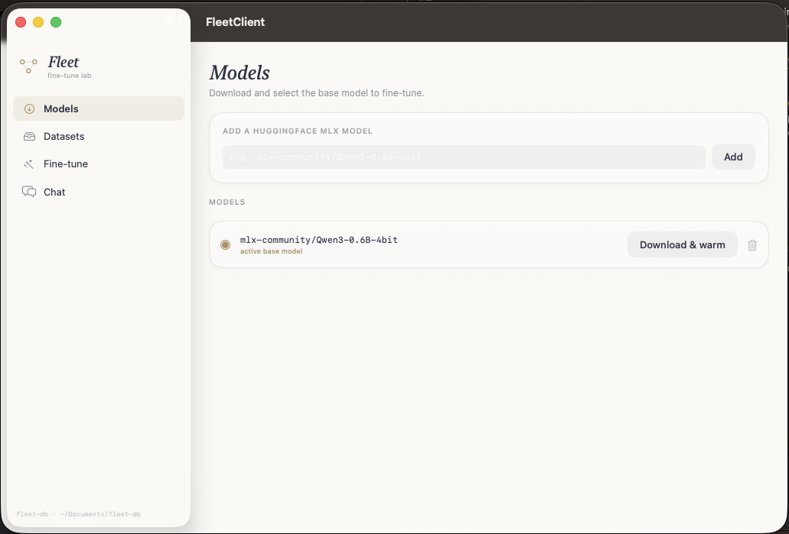

# Fleet

<p align="center">
  
</p>

**Swift Agent Harness.** Off-load micro fine-tuning jobs onto small on-device
LLMs, route Totem contexts into Frigates to aggregate within Seer.

Fleet is the *coordinator*. It takes contexts from many sources and media types,
routes each one to the proper decoder, aligns everything into a single data
structure, and hands that to a LoRA fine-tuning job executed by
[Frigate](https://github.com/rao-studios/Frigate) — the MLX/GPU engine. Fleet never reimplements training,
model loading, or inference; it drives Frigate's existing machinery.

## The demo: folder → fine-tune

Point Fleet at a folder of mixed media and it will fine-tune a small LLM from it:

```bash
swift build
./build-metallib.sh            # macOS: compile MLX Metal shaders (one time per build)

swift run fleet finetune \
  --input ./my-notes \
  --output ./adapter \
  --iterations 200 --rank 8
```

> **macOS note:** Frigate's MLX GPU backend loads compiled Metal shaders at
> runtime. Run `./build-metallib.sh` once after `swift build` to place
> `mlx.metallib` next to the binary, otherwise MLX fails with *"Failed to load
> the default metallib"*.

This is the **core highway and coordination pattern**:

1. **Enumerate** — `FolderContextProvider` walks the directory.
2. **Route** — `DecoderRegistry` sends each file to the decoder that claims its
   extension (the coordination step).
3. **Decode & chunk** — each decoder emits `ContextFragment`s; long text is split
   into training-sized chunks.
4. **Align** — every fragment collects into one `Corpus` (the single unified
   structure, shaped to echo a Totem partition).
5. **Format** — `DatasetFormatter` builds shuffled train/validation `[String]`
   arrays (and writes `train.jsonl` / `valid.jsonl` for inspection).
6. **Fine-tune** — `FleetTrainer` loads the base model through Frigate, attaches
   LoRA, and runs Frigate's `LoRATrain.train`.
7. **Package** — the adapter is written to the output directory as
   `adapter_config.json` + `adapters.safetensors`, reloadable via
   `LoRAContainer.from(directory:)`.

## Supported media

| Decoder | Extensions | Notes |
|---|---|---|
| Plain text | `txt`, `text`, `log`, `rst`, `org`, `tex` | Foundation only |
| Markdown | `md`, `markdown`, `mdown`, `mkd`, `mdx` | split on headings |
| Code | `swift`, `py`, `js`, `ts`, `go`, `rs`, `java`, `c`, `cpp`, … | fenced w/ language |
| JSON / JSONL | `json`, `jsonl`, `ndjson` | one fragment per JSONL line |
| CSV / TSV | `csv`, `tsv` | rows flattened to `column: value` |
| PDF | `pdf` | **Apple only** (PDFKit) |
| Image | `png`, `jpg`, `heic`, `gif`, … | caption via VLM — **Apple only**, opt-in `--vision` |
| Audio | `wav`, `mp3`, `m4a`, `flac`, … | transcribe via Apple Speech — **Apple only**, opt-in `--audio` |

Enable the inference-backed decoders explicitly:

```bash
swift run fleet finetune --input ./mixed --output ./adapter --vision --audio
```

## Architecture (one package, several library targets)

| Target | Role | Heavy deps |
|---|---|---|
| `FleetCore` | unified data structure (`ContextFragment`, `Corpus`) + coordination protocols (`MediaDecoder`, `DecoderRegistry`, `ContextProvider`) + `TextChunker` + `DatasetFormatter` | none (Foundation) |
| `FleetMedia` | concrete text/markdown/code/json/csv/pdf decoders + image/audio decoders (inference via injected closures) + the standard registry | none (Foundation) |
| `FleetAudio` | `AudioTranscriber` protocol + Apple `SpeechTranscriber` | Apple `Speech` (guarded) |
| `FleetVision` | `ImageCaptioner` over Frigate's `MLXVLM` | Frigate / MLX (guarded) |
| `FleetStore` | `fleet-db`: UUID-keyed `TrainingDataset` + `TrainedAdapter` storage (ported from Totem's `FilePersistence`) | none (Foundation) |
| `FleetTraining` | `FleetTrainer` + `FineTuningConfig` over Frigate's `LoRATrain` | Frigate / MLX |
| `FleetInference` | `ChatSession` (base + LoRA adapter) and `ModelLoader` | Frigate / MLX |
| `Fleet` | umbrella that re-exports all of the above | — |
| `FleetCLI` | the `fleet finetune …` / `fleet chat …` executable | swift-argument-parser |

A macOS app, [`Client/`](Client/) (`FleetClient`), drives the whole loop
interactively — download a model, build a notes/Q&A dataset, fine-tune, then A/B
chat the base vs the fine-tuned LoRA to test memory recall.

`FleetCore`, `FleetMedia`, and `FleetAudio` carry no MLX/Frigate dependency, so
they build fast and stay portable. Image/audio decoders take inference *closures*
(`ImageCaptioning` / `AudioTranscribing`) rather than concrete engines, which is
what keeps `FleetMedia` free of the heavy graph — the CLI wires the closures from
`FleetVision`/`FleetAudio` at the edge.

## Linux compatibility

The package compiles and runs the **text path** on Linux. Anything that needs an
Apple framework is isolated behind `#if canImport(...)` and degrades gracefully:

- `FleetVision` (`canImport(CoreImage)`) — Frigate excludes its VLM stack on
  Linux, so image captioning is a no-op there.
- `FleetAudio` (`canImport(Speech)`) — Apple Speech is the only bundled ASR;
  Linux falls back to a no-op transcriber.
- `PDFTextDecoder` (`canImport(PDFKit)`) — on Linux `pdf` is simply unregistered.

So on Linux you get text/markdown/code/json/csv → fine-tune; PDF/image/audio are
skipped. The build stays green either way. (Frigate's MLX core itself builds on
Linux with CUDA or a CPU fallback via its `SPM_CUDA` setup.)

## Roadmap

- **Totem as a `ContextProvider`** — Totem partitions already match
  `ContextFragment`; a `TotemContextProvider` over its HTTP/gRPC API is the next
  provider once Totem exposes a public library.
- **Adapter inference** — Frigate's `FrigateLLM` cannot yet load LoRA adapters; a
  `fleet generate` subcommand follows once it can.
- A cross-platform `AudioTranscriber` once a model is
  vendored into Frigate or into Fleet. (SFSpeechRecognizer is used otherwise).

## Dependencies

- [Frigate](https://github.com/rao-studios/Frigate) — vendored MLX engine (LLM/VLM inference, LoRA training).
- [swift-argument-parser](https://github.com/apple/swift-argument-parser) — CLI.

Licensed under GPLv3.
